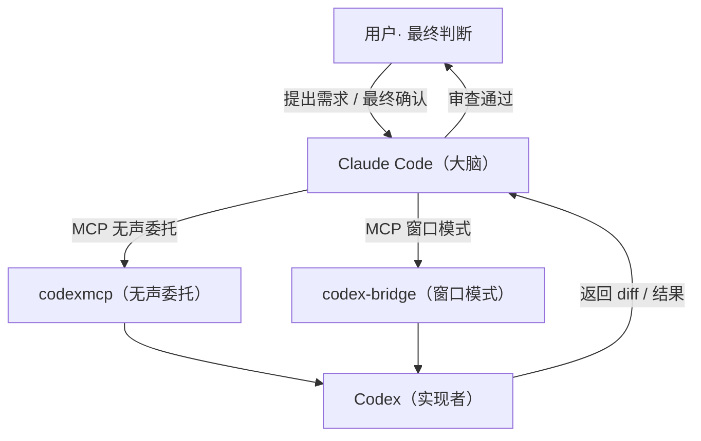
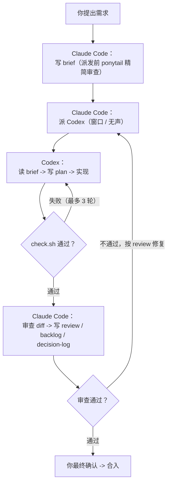

# &#x20;Codex-Claude-collab-skill&#x20;

> 让 **Claude Code 当大脑**（分析需求 / 拆解任务 / 派活 / 审查），**Codex 当实现者**（读简报 / 写方案 / 改代码 / 跑验证），双模型协作完成开发任务；并内置 **ponytail 懒高级开发模式**——先摸清上下文、再决定写什么不写什么，用最少代码实现同等功能，避免重复造轮子。

[](LICENSE)


## ✨ 特性

- **一写一审**：同一时间只有一个工具写代码（默认 Codex 写、Claude 审），杜绝互相覆盖。
- **文件驱动协作**：通过 `.ai/`（brief / plan / review / backlog / decision-log）+ Git 传递上下文，不靠对话记忆。
- **验证闭环**：每次修改后必须跑 `scripts/check.sh`，失败自动修复（最多 3 轮），不通过不结束。
- **窗口 / 无声双模式**：默认窗口模式（弹出终端实时看 Codex 干活），一句话随时切无声委托。
- **子代理委派**：Codex 按任务类型自行调用 60+ 子代理（`python-reviewer` / `code-explorer` / `security-reviewer` 等）。
- **ponytail 懒高级开发**：派发前先做精简审查（YAGNI → 复用 → stdlib → 原生 → 已装依赖 → 一行 → 最小实现），但**绝不精简**验证、错误处理、安全性、可访问性。
- **一键安装**：Windows 下 `install.ps1` 自动部署窗口桥 + MCP + skills。

## 🚀 快速上手（Windows）

```powershell
# 1. 克隆本仓库
git clone https://github.com/yiximy/codex-claude-collab-skill.git
cd codex-claude-collab-skill

# 2. 一键安装（自动检查依赖、部署 codex-bridge、合并 MCP 配置、安装 skills）
powershell -ExecutionPolicy Bypass -File install.ps1

# 3. 按下文「4. 手动安装步骤」配置 Codex 后端（以 DeepSeek 为例）后重启 Claude Code
# 4. 在目标项目目录启动 Claude Code，说：启用 codex-claude-collab 协作模式
#    （会自动生成 AGENTS.md / CLAUDE.md / .ai/ / scripts/check.sh）
```

> 没有 Claude Code 或 Codex？`install.ps1` 会自动安装（npm 全局安装，需 Node.js 18+）。
> 也可以完全手动安装：见下文「4. 手动安装步骤」。

## 🧩 组件

| 组件                                        | 说明                                                                                          |
| ----------------------------------------- | ------------------------------------------------------------------------------------------- |
| `skills/claude/codex-claude-collab-brain` | Claude Code 大脑视角 skill（派发前 ponytail 精简审查）                                                   |
| `skills/codex/codex-claude-collab-worker` | Codex 实现者视角 skill（实现时 ponytail 7 步梯子 + 子代理委派）                                               |
| `skills/*/ponytail*`                      | ponytail 懒高级开发模式（6 个 skill：`ponytail` / `-review` / `-audit` / `-debt` / `-gain` / `-help`） |
| `bridge/`                                 | codex-bridge 窗口模式 MCP 桥（含 Windows 参数 / 信任修复）                                                |
| `install.ps1`                             | Windows 一键安装脚本（依赖检查 / 桥部署 / MCP 合并 / skills 安装）                                             |
| `config-examples/`                        | 各配置文件示例（占位符，不含真实密钥）                                                                         |

## 🔒 安全说明

- 本仓库**不含任何 API Key / Token / 密码**；`config-examples/` 中均为占位符（如 `你的用户名`、`你的项目路径`）。
- 请勿提交 `~/.claude.json`、`~/.codex/auth.json`、`~/.ai-bridge/config.json` 等含真实凭据的文件（已在 `.gitignore` 排除）。
- 推送前请做敏感信息扫描；

## 📚 详细文档

以下为完整教程：整体架构 → 环境要求 → 一键安装 → 手动安装 → 使用指南 → 常见问题 → 目录说明 → 致谢。

***

## 1. 整体架构



**两个 MCP 桥（可并存，按需选用）：**

| 桥                               | 模式   | 特点                                                                        | 适用                 |
| ------------------------------- | ---- | ------------------------------------------------------------------------- | ------------------ |
| **codexmcp**（GuDaStudio）        | 无声委托 | 一次性提交 -> 等待 -> 拿回 JSON 结果；不开窗口；支持`SESSION_ID` 多轮续接                        | 出方案、审查、生成 diff、短任务 |
| **codex-bridge**（uuz495，本包含修复版） | 窗口模式 | 弹出真实终端窗口显示 Codex 的 TUI，你能实时看到它干活；Claude 用`peek_codex`/`wait_for_codex` 追踪 | 实际改代码、跑长任务、想监督     |

**协作文件约定（每个项目内）：**

```
project/
├── AGENTS.md          # Codex 读的项目规范（含写权限/工作流/验证）
├── CLAUDE.md          # Claude Code 读的项目上下文（只读审查角色）
├── scripts/check.sh   # 统一验证脚本（每次修改后必跑）
└── .ai/
    ├── brief.md       # 当前任务简报（目标/验收标准/当前写者）
    ├── plan.md        # Codex 的方案设计
    ├── review.md      # Claude Code 的审查意见
    ├── backlog.md     # 额外问题与待办
    └── decision-log.md# 决策记录
```

***

### 1.1 ponytail：懒高级开发模式（默认开启）

本包集成了 [ponytail](https://github.com/DietrichGebert/ponytail)（v4.9.0，MIT）——让 AI 表现得像"房间里最懒的高级开发人员"：**最好的代码是没写出来的代码**。

协作流程中的体现：

- **Claude Code（大脑）派发任务前**：先做 ponytail 精简审查——这个功能真的需要写吗（YAGNI）？代码库里已有吗（复用）？标准库/平台/已装依赖能搞定吗？能一行吗？最后才给出最小实现方案，把"复用清单 / 跳过清单 / 最小实现要求"写进 `.ai/brief.md` 再派给 Codex。
- **Codex（实现者）执行时**：同样遵循 7 步梯子，用最少代码实现同等功能，避免重复造轮子。
- **边界（绝不妥协）**：精简 ≠ 砍掉**验证、错误处理、安全性、可访问性**。简洁是因为确实符合需求，而不是为了追求简洁牺牲质量；非平凡逻辑必须留下一个最小可运行验证。

> ponytail 的 6 个 skill（`ponytail`、`ponytail-review`、`ponytail-audit`、`ponytail-debt`、`ponytail-gain`、`ponytail-help`）会随本包一起安装到 Claude Code 和 Codex；也支持官方插件方式：`/plugin marketplace add DietrichGebert/ponytail` + `/plugin install ponytail@ponytail`（可自动更新）。

## 2. 环境要求

| 依赖          | 要求                            | 说明                              |
| ----------- | ----------------------------- | ------------------------------- |
| Windows     | 11                            | 窗口桥目前只在 Windows 11上验证过          |
| Node.js     | 18+（含 npm）                    | 运行 Codex CLI 和 Claude Code 需要   |
| Git         | 任意版本                          | bash 运行 check.sh（Git Bash）      |
| Python      | 3.12+                         | 运行窗口桥（codex-bridge）             |
| uv          | 最新版本                          | 运行 codexmcp（可选，只用无声桥时需要）        |
| Codex       | ChatGPT 订阅**或** OpenAI 兼容 API | -                               |
| Claude Code | 2.x                           | -                               |
| CC Switch   | v3.19.2+                      | 用于给Claude Code与Codex接入第三方模型（可选） |

***

## 3. 快速开始（一键安装）

在 PowerShell 中运行本包内的安装脚本：

```powershell
powershell -ExecutionPolicy Bypass -File .\install.ps1
```

脚本会自动：

1. 检查依赖（node/npm/git/python），提示缺失项
2. 安装 npm 版 Codex CLI（`@openai/codex`）——**必须用 npm 版**，Windows 商店版无法被子进程调用
3. 部署窗口桥到 `~\claude-codex-bridge`，创建独立 venv 并安装依赖（固定 `mcp<2`，规避 mcp 2.0 兼容问题）
4. 写入窗口桥配置 `~/.ai-bridge/config.json`（首次）
5. 把两个 MCP server（`codex` + `codex-bridge`）合并进 `~/.claude.json`（**不会覆盖**已有 MCP 配置）
6. 把两份 skill 复制到 `~/.claude/skills/` 和 `~/.codex/skills/`
7. 输出**剩余手动步骤**（登录、provider 配置、信任确认等）

> 建议运行前备份：`Copy-Item ~/.claude.json ~/.claude.json.bak`

***

## 4. 手动安装步骤（不用脚本就按这个来）

### 4.1 安装 Codex CLI（npm 版）

```powershell
npm install -g @openai/codex
codex --version   # 应输出 codex-cli x.y.z
```

### 4.2 配置 Codex 后端（以 DeepSeek 为例）

编辑 `~/.codex/config.toml`，追加 OpenAI 兼容 provider（示例见 `config-examples/codex-config.toml.example`）：

```toml
model_provider = "custom"
model = "deepseek-v4-flash"        # 换成你的模型名

[model_providers.custom]
name = "deepseek"
base_url = "https://api.deepseek.com"
wire_api = "responses"             # 部分服务用 "chat"
requires_openai_auth = true
```

把 API Key 写入 `~/.codex/auth.json`：

```json
{ "OPENAI_API_KEY": "sk-你的key" }
```

验证：

```powershell
codex exec --json -s read-only "Reply with exactly: PONG"
```

> 返回 `PONG` 即就绪。ChatGPT 订阅用户跳过本步，直接 `codex login`。

### 4.3 安装无声桥（codexmcp）

```powershell
# 安装 uv（如未安装）
powershell -ExecutionPolicy ByPass -c "irm https://astral.sh/uv/install.ps1 | iex"
```

在 `~/.claude.json` 的 `mcpServers` 中加入：

```json
"codex": {
  "type": "stdio",
  "command": "uvx",
  "args": ["--from", "git+https://github.com/GuDaStudio/codexmcp.git", "--with", "mcp<2", "codexmcp"]
}
```

> `--with "mcp<2"` 必须保留：mcp 2.0 移除了 `mcp.server.fastmcp`，codexmcp 只兼容 mcp 1.x。

### 4.4 安装窗口桥（codex-bridge）

```powershell
Copy-Item .\bridge $HOME\claude-codex-bridge -Recurse
python -m venv $HOME\claude-codex-bridge\.venv
$HOME\claude-codex-bridge\.venv\Scripts\python.exe -m pip install "mcp>=1.0.0,<2"
```

写 `~/.ai-bridge/config.json`（示例见 `config-examples/ai-bridge-config.json.example`），注册 MCP：

```json
"codex-bridge": {
  "type": "stdio",
  "command": "C:\\Users\\你的用户名\\claude-codex-bridge\\.venv\\Scripts\\python.exe",
  "args": ["C:\\Users\\你的用户名\\claude-codex-bridge\\run.py"]
}
```

### 4.5 安装 skills

```powershell
Copy-Item .\skills\claude\codex-claude-collab-brain $HOME\.claude\skills\ -Recurse
Copy-Item .\skills\codex\codex-claude-collab-worker $HOME\.codex\skills\ -Recurse
```

ponytail 6 个 skill（懒高级开发模式，配合协作 skill 使用）也一并安装：

```powershell
foreach ($ps in @("ponytail","ponytail-review","ponytail-audit","ponytail-debt","ponytail-gain","ponytail-help")) {
  Copy-Item ".\skills\claude\$ps" $HOME\.claude\skills\ -Recurse
  Copy-Item ".\skills\codex\$ps" $HOME\.codex\skills\ -Recurse
}
```

> 这 6 个 skill 让 Claude Code 派发前先做"精简审查"、Codex 实现时遵循"7 步梯子"（YAGNI → 复用 → stdlib → 原生 → 已装依赖 → 一行 → 最小实现），用最少代码实现同等功能。详见 `skills/claude/ponytail/SKILL.md`。

### 4.5b 配置全局 CLAUDE.md（重要，防止角色分工错乱）

把 `config-examples/global-CLAUDE.md.example` 的内容粘贴/合并到 `~/.claude/CLAUDE.md`（或直接替换）。

它定义了**角色分工**：Claude Code = 大脑/协调者（写 brief、派活、审查，**不直接改源代码**），Codex = 实现者（改代码、跑 check.sh）。并包含窗口/无声模式切换规则（默认窗口，可手动切换）。

> 如果不配置这段，Claude Code 可能沿用旧的"自己写代码"习惯，导致与 skill 的"Codex 写、Claude 审"冲突。

### 4.6 中文/非 ASCII 路径（可选但强烈建议）

Codex TUI 在非 ASCII 路径下有编码 bug。解决：建 ASCII junction + 配置映射。

```powershell
New-Item -ItemType Junction -Path C:\codex-workspace -Target "D:\中文项目路径"
```

`~/.ai-bridge/config.json` 中加：

```json
"cwd_remaps": [["D:\\中文项目路径", "C:\\codex-workspace"]]
```

`~/.codex/config.toml` 中加信任：

```toml
[projects.'c:\codex-workspace']
trust_level = "trusted"
```

### 4.7 验证

```powershell
claude mcp list   # 应看到 codex 和 codex-bridge 都 √ Connected
```

***

## 5. 使用指南

### 5.1 启用协作模式（每个项目一次）

在目标项目目录启动 Claude Code，然后说：`启用 codex-claude-collab 协作模式`。会自动生成 `AGENTS.md`、`CLAUDE.md`、`.ai/`（5 个文件）、`scripts/check.sh`。

> **注意**：窗口模式的 Codex 工作目录 = Claude Code 的**启动目录**，请**在项目目录里启动 Claude Code**。

### 5.2 派活给 Codex（两种方式）

| 想要的效果             | 说                                  |
| ----------------- | ---------------------------------- |
| 无声分析/方案/审查（不开窗口）  | "用 codex 无声分析一下 X"                 |
| 窗口模式（开窗口看到它干活，默认） | "让 codex 实现 X" / "开窗口让 codex 修复 X" |

默认策略（skill 已配置）：**所有 Codex 任务默认窗口模式**；明确说"无声/不要开窗口"才走无声委托。

### 5.3 协作循环



> **派发前精简审查（ponytail）**：Claude Code 写 `.ai/brief.md` 时，先走 7 步梯子——YAGNI 跳过投机需求、代码库已有就复用（写进"复用清单"）、stdlib/平台/已装依赖优先、能一行就一行，最后才给最小实现方案。Codex 实现时同样遵循梯子，但**绝不精简**验证、错误处理、安全性、可访问性；非平凡逻辑留一个最小可运行验证（assert 自检或小测试），平凡一行不用测。

***

### 5.4 子代理委派（Codex 按任务类型自行调用子代理）

Codex 拥有 `spawn_agent` 子代理能力。执行 Claude Code 派发的任务时，Codex 会根据任务类型**自行调用**相关子代理辅助分析、规划、审查与构建修复：

| 任务类型                     | Codex 会调用的子代理示例                                                              |
| ------------------------ | ---------------------------------------------------------------------------- |
| 陌生代码库分析                  | `code-explorer`                                                              |
| 复杂功能 / 重构方案              | `planner`、`code-architect`                                                   |
| Python 代码审查              | `python-reviewer`                                                            |
| TypeScript / React / Vue | `typescript-reviewer`、`react-reviewer`、`vue-reviewer`                        |
| 其他语言审查                   | `go-reviewer`、`rust-reviewer`、`java-reviewer`、`cpp-reviewer` 等（按语言）          |
| 构建 / 类型错误                | `build-error-resolver`、`python-build-resolver`、`react-build-resolver` 等（按语言） |
| 安全敏感改动                   | `security-reviewer`                                                          |
| 性能优化                     | `performance-optimizer`                                                      |

- Claude Code 派活时会在 prompt 中提示 Codex"根据任务类型调用相关子代理"。
- 子代理产出由 Codex 整合进代码与 `.ai/`，最终修改责任在 Codex；写权限互斥与"改后跑 check.sh"仍适用。
- 并行并发上限在 `~/.codex/config.toml` 中配置：

`	oml [agents] max_concurrent_threads_per_session = 8 `     &#x20;

## 6. 常见问题（FAQ）

**Q1：窗口桥报** **`error: unexpected argument 'xxx' found`**

`wt new-tab` 对 prompt 二次拼接导致参数拆分。本包 bridge 已修复：默认改用 `CREATE_NEW_CONSOLE`（CreateProcess 直传命令行）+ prompt 清洗（换行->空格、双引号->中文引号）。仍遇到就重启 Claude Code 加载新代码。

**Q2：窗口卡在 "Do you trust the contents of this directory?"**

该目录不在 config.toml 的 `[projects."路径"] trust_level = "trusted"` 中。按回车选 **1. Yes, continue** 一次即可，或手动加 trust（见 4.6）。Codex App/CC Switch 重写 config.toml 时可能覆盖 trust，需要时重新加。

**Q3：`No module named 'mcp.server.fastmcp'`**

mcp 2.0 移除了 FastMCP。codexmcp 用 `--with "mcp<2"`，codex-bridge 用 `pip install "mcp>=1.0.0,<2"`。

**Q4：`claude mcp add`** **在 Windows 上报 unknown option**

`--` 后的 flag 被误解析。绕开：直接编辑 `~/.claude.json` 的 `mcpServers`（install.ps1 就是这么做的）。

**Q5：窗口模式因非 ASCII 路径失败**

见 4.6，建 junction + `cwd_remaps`。

**Q6：为什么必须用 npm 版 Codex CLI？**

Windows 商店版 Codex 的 exe 受 ACL 限制，子进程无法调用（Access denied）。npm 版与商店版共用 `~/.codex/config.toml` 和 `auth.json`。

**Q7：想用 ChatGPT 订阅而不是 API？**

跳过 4.2，改执行 `codex login`（Sign in with ChatGPT）。注意环境变量若有 `OPENAI_API_KEY`，Codex 会优先用它产生 API 计费。

**Q8：Codex 的默认模型能跟随 CC Switch 切换吗？**

能。窗口桥默认 `codex_model_follow_codex_config=true`，每次调用 Codex 时自动读取 `~/.codex/config.toml` 的顶层 `model`（CC Switch 切换 provider 时会重写它），所以**在 CC Switch 里切换模型即可**，无需改 `~/.ai-bridge/config.json`。想固定模型就设环境变量 `CCB_FOLLOW_CODEX_CONFIG=0` + `CCB_CODEX_MODEL=xxx`（旧方式仍可用）。

***

## 7. 目录说明

```
codex-claude-collab-pack/
├── README.md                          # 本教程
├── install.ps1                        # 一键安装（Windows）
├── skills/
│   ├── codex/codex-claude-collab-worker/     # Codex 版 skill（worker 实现者视角）
│   ├── codex/ponytail*/                      # ponytail 6 个 skill（懒高级开发：YAGNI/复用/stdlib/最小实现）
│   └── claude/codex-claude-collab-brain/    # Claude Code 版 skill（brain 大脑视角）
│   └── claude/ponytail*/                     # ponytail 6 个 skill（懒高级开发：派发前精简审查）
├── bridge/                            # 窗口桥源码（含 Windows 参数/信任修复）
└── config-examples/
    ├── codex-config.toml.example
    ├── ai-bridge-config.json.example
    ├── claude-mcp-servers.json.example
    └── global-CLAUDE.md.example
```

## 8. 致谢 / 上游项目

- [codexmcp](https://github.com/GuDaStudio/codexmcp) — 无声委托 MCP 桥（MIT）
- [claude-codex-bridge](https://github.com/uuz495/claude-codex-bridge) — 窗口模式 MCP 桥（MIT，本包含 Windows 修复）
- [ponytail](https://github.com/DietrichGebert/ponytail) — 懒高级开发模式：YAGNI / stdlib-first / 最小实现（MIT）
- [CC Switch](https://github.com/farion1231/cc-switch) — 可选：Claude Code / Codex 多供应商切换工具

***

